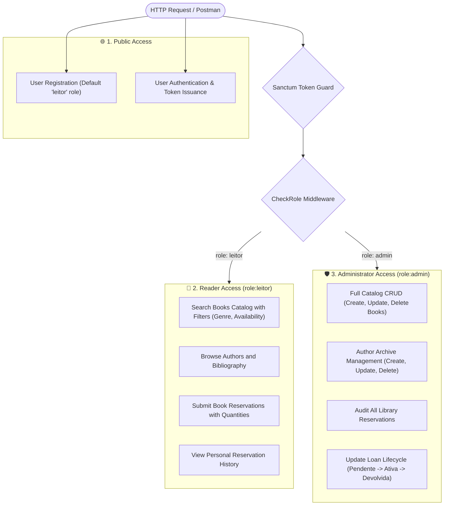
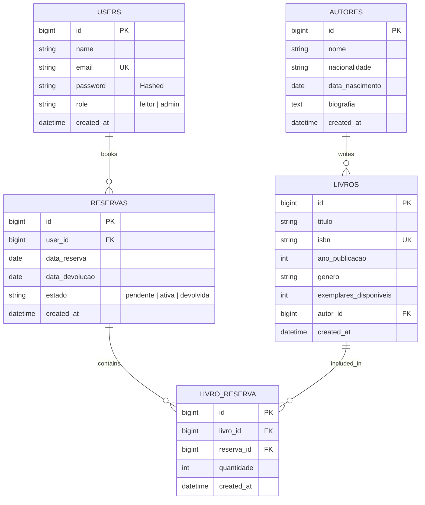
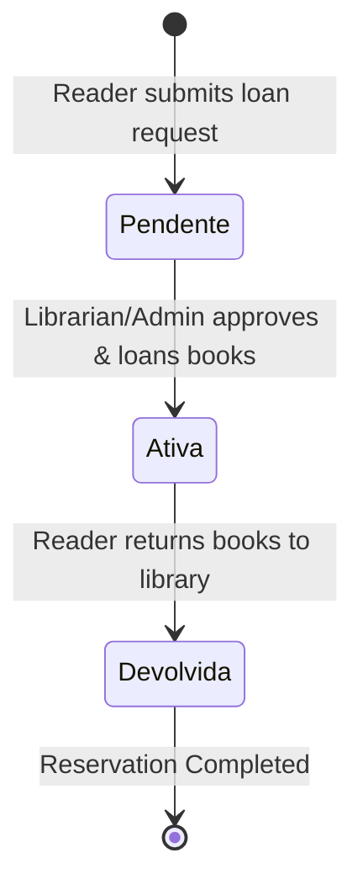

# 📚 Book Library & Reservation API

<p align="center">
  
  
  
  
  
  
</p>

> A robust, enterprise-grade RESTful API engineered with **Laravel 11**, **Eloquent ORM**, and **Laravel Sanctum**. Built for digital library catalog management, literary author archiving, and multi-book reservation workflows featuring Many-to-Many pivot relations and Role-Based Access Control (**RBAC**).

---

## ⚡ Role-Based Access Hierarchy (RBAC)



---

## 📊 Database Schema & Relationships (ERD)



---

## 🔄 Book Reservation Lifecycle



---

## ✨ Key Architectural Highlights

* **Clean RBAC Isolation:** Custom `CheckRole` middleware separates reader interactions from administrative catalog management.
* **Many-to-Many Pivot Table:** The `livro_reserva` intermediate table tracks individual copies (`quantidade`) per reservation request.
* **Smart Catalog Querying:** Built-in Eloquent filtering for books by genre and availability:
  * `?genero=Romance`
  * `?disponivel=true`
* **Defensive Date Validation:** Enforces logical circulation rules: start dates must be today or future (`after_or_equal:today`), and return dates must succeed start dates (`after:data_reserva`).
* **Automated Feature Tests:** Test suite in `tests/Feature/BookLibraryApiTest.php` covering authentication, catalog searching, loan submissions, and RBAC restrictions.

---

## 📑 API Endpoints Reference

### 🔐 Authentication (`/api`)

| Method | Endpoint | Access | Description | Payload Example |
| :--- | :--- | :--- | :--- | :--- |
| `POST` | `/api/register` | Public | Register new user (defaults to `leitor`) | `{"name": "Ana", "email": "ana@ex.pt", "password": "pass", "role": "leitor"}` |
| `POST` | `/api/login` | Public | Authenticate and issue Sanctum token | `{"email": "ana@ex.pt", "password": "pass"}` |
| `GET` | `/api/me` | 🔒 **Authenticated** | Get current authenticated user profile | _None_ |
| `POST` | `/api/logout` | 🔒 **Authenticated** | Revoke current access token | _None_ |

### 📚 Catalog (Books & Authors)

| Method | Endpoint | Access | Description | Payload Example |
| :--- | :--- | :--- | :--- | :--- |
| `GET` | `/api/livros` | 🔒 **Authenticated** | List books with author info (`?genero=Poesia&disponivel=true`) | _None_ |
| `GET` | `/api/livros/{id}` | 🔒 **Authenticated** | Get details of a single book | _None_ |
| `POST` | `/api/livros` | 🛡️ **Admin Only** | Add new book to catalog | `{"titulo": "Os Maias", "isbn": "978...", "ano_publicacao": 1888, "genero": "Romance", "exemplares_disponiveis": 5, "autor_id": 1}` |
| `PUT` | `/api/livros/{id}` | 🛡️ **Admin Only** | Update book information | `{"exemplares_disponiveis": 4}` |
| `DELETE` | `/api/livros/{id}` | 🛡️ **Admin Only** | Remove book from catalog | _None_ |
| `GET` | `/api/autores` | 🔒 **Authenticated** | List authors with book counts | _None_ |
| `GET` | `/api/autores/{id}` | 🔒 **Authenticated** | Get author details with books | _None_ |
| `POST` | `/api/autores` | 🛡️ **Admin Only** | Create author record | `{"nome": "Fernando Pessoa", "nacionalidade": "Portuguesa"}` |
| `PUT` | `/api/autores/{id}` | 🛡️ **Admin Only** | Update author record | `{"biografia": "Famous Portuguese poet..."}` |
| `DELETE` | `/api/autores/{id}` | 🛡️ **Admin Only** | Remove author record | _None_ |

### 📅 Book Reservations (`/api/reservas`)

| Method | Endpoint | Access | Description | Payload Example |
| :--- | :--- | :--- | :--- | :--- |
| `GET` | `/api/reservas/minhas` | 📖 **Reader Only** | Retrieve reader's personal reservations | _None_ |
| `POST` | `/api/reservas` | 📖 **Reader Only** | Submit book reservation request | `{"data_reserva": "2026-10-01", "data_devolucao": "2026-10-15", "livros": [{"id": 1, "quantidade": 1}]}` |
| `GET` | `/api/reservas` | 🛡️ **Admin Only** | View all library reservations (Paginated) | _None_ |
| `PATCH` | `/api/reservas/{id}` | 🛡️ **Admin Only** | Update loan state (`pendente`, `ativa`, `devolvida`) | `{"estado": "ativa"}` |

---

## 🔑 Pre-Configured Test Accounts (Seeders)

| Role | Email | Password | Privileges |
| :--- | :--- | :--- | :--- |
| **Administrator** | `admin@biblioteca.pt` | `admin123` | Full catalog management (CRUD books & authors) and loan lifecycle moderation |
| **Reader (`leitor`)** | `joao@exemplo.pt` | `leitor123` | Can search books, book reservations, and view personal loan history |

---

## 🛠️ Quickstart & Local Setup

### 1. Prerequisites
* **PHP 8.3+** with SQLite extension
* **Composer**

### 2. Clone the Repository
```bash
git clone https://github.com/Afonsojlc/book-library-api.git
cd book-library-api
```

### 3. Install Dependencies
```bash
composer install
```

### 4. Configure Environment
```bash
cp .env.example .env
php artisan key:generate
```
Ensure your `.env` contains:
```env
DB_CONNECTION=sqlite
```

### 5. Initialize & Seed Database
```bash
touch database/database.sqlite
php artisan migrate:fresh --seed
```

### 6. Start the Server
```bash
php artisan serve
```
The API is available at: `http://127.0.0.1:8000/api`

---

## 🧪 Running Automated Tests

Run the feature test suite:
```bash
php artisan test
```

---

## 📬 Postman Suite Testing

Ready-to-use Postman files are available inside the [`Postman/`](Postman/) folder:
* [`Postman/book-library-api.postman_collection.json`](Postman/book-library-api.postman_collection.json)
* [`Postman/book-library-api.postman_environment.json`](Postman/book-library-api.postman_environment.json)

### Instructions:
1. Open **Postman** and click **Import**.
2. Select both JSON files inside the `Postman/` folder.
3. Choose the **Book Library API** environment.
4. Execute the **Login** request (`admin@biblioteca.pt` or `joao@exemplo.pt`) to automatically populate the `{{token}}` variable.

---

## 📁 Repository Structure

```text
book-library-api/
├── app/
│   ├── Http/
│   │   ├── Controllers/          # Auth, Autor, Livro, and Reserva controllers
│   │   └── Middleware/           # CheckRole RBAC middleware
│   └── Models/                   # Autor, Livro, Reserva, User models
├── database/
│   ├── migrations/               # Schema definitions (including livro_reserva pivot)
│   └── seeders/                  # Seeders (Saramago, Pessoa, Eça de Queirós, users)
├── docs/
│   └── manual_laravel_biblioteca.md # Documentation & assignment archive
├── routes/
│   └── api.php                   # Public, Reader, and Admin routes
├── tests/
│   └── Feature/
│       └── BookLibraryApiTest.php # Feature test suite
├── Postman/                      # Postman collection & environment
├── composer.json                 # Project dependencies
└── README.md                     # Comprehensive documentation
```

---

## 👤 Author

**Afonso Carvalho**
* GitHub: [@Afonsojlc](https://github.com/Afonsojlc)
* LinkedIn: [Afonso Carvalho](https://www.linkedin.com/in/afonso-carvalho-64796328a/)

---

## 📄 License

This project is licensed under the [MIT License](LICENSE).
